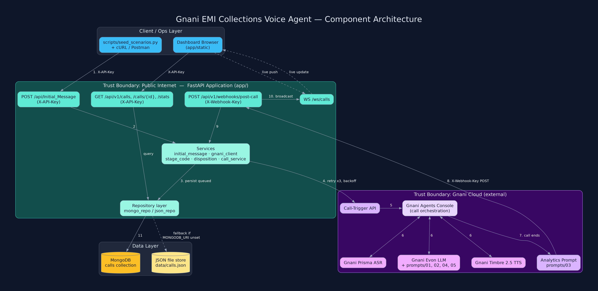
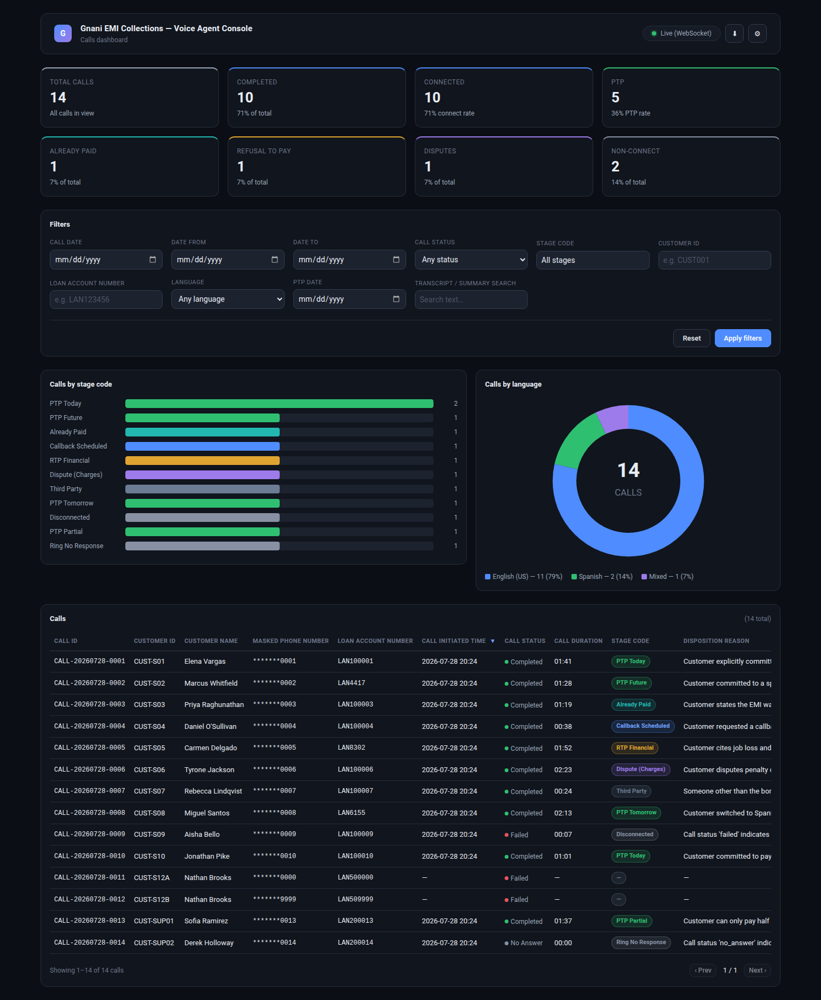
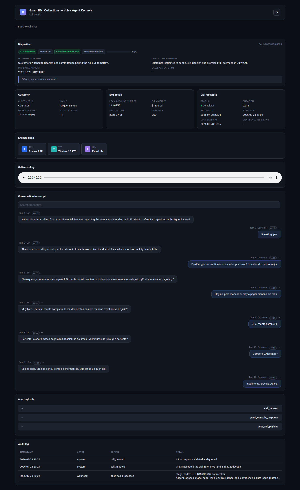

# Gnani EMI Collections Voice Agent

Outbound AI voice agent for EMI (loan installment) collections, built on the **Gnani Agents
Console** platform (required stack: Gnani Prisma ASR, Gnani Timbre 2.5 TTS, Gnani Evon LLM — see
"Gnani Agents Console configuration" below for what this Console tenant actually exposes) with a
Python FastAPI backend, a MongoDB/JSON-backed data layer, and a dark-themed operations dashboard.
This is a submission for the *Technical Assignment: Build an End-to-End AI Voice Agent on Gnani
Agents Console*.

## Overview

The agent places outbound calls to customers about an overdue or upcoming EMI, conducts a
bilingual (English US / Spanish), multi-turn conversation to determine payment intent, and
produces an evidence-based `stage_code` and disposition — never an assumed one. A FastAPI
application initiates each call (`POST /api/Initial_Message`), receives the post-call disposition
webhook from Gnani Agents Console (`POST /api/v1/webhooks/post-call`), persists it idempotently,
and exposes it through a REST + WebSocket API consumed by a lightweight HTML/CSS/JS dashboard.
The full API and data contract is defined in [`CONTRACT.md`](./CONTRACT.md).

## Gnani Agents Console configuration

The agent for this submission was created and configured in the real **Gnani Agents Console**
(`https://app.gnani.ai`) in a live session. Full reproduction steps, verbatim console field/option
names, and raw findings are in [`gnani_config/README.md`](./gnani_config/README.md) and
[`gnani_config/CONSOLE_FINDINGS.md`](./gnani_config/CONSOLE_FINDINGS.md).

| | |
|---|---|
| Agent name | `EMI Collections Agent - Apex Financial` |
| Agent ID | `d411993d126843e2912509f931d54ee2` |
| Direct config URL | `https://app.gnani.ai/agents/agent/update?agentId=d411993d126843e2912509f931d54ee2&configTab=Agent+Details` |
| Agent list URL | `https://app.gnani.ai/agents/agent/list` |

**Requirement → Console mapping.** The assignment requires Gnani Prisma ASR, Gnani Timbre 2.5
TTS, and Gnani Evon LLM. In the live Console tenant used for this submission, "Prisma" and
"Timbre 2.5" are not exposed as selectable models — the Gnani-native model actually available in
each slot was selected in every case, so the requirement that all three components are Gnani's
native stack is satisfied at the tenant-configuration level:

| Assignment-required component | Console provider/model available in this tenant | Selected | Note |
|---|---|---|---|
| Gnani Prisma ASR | Gnani, Microsoft; Gnani-native model: **Responsive** only | Gnani / **Responsive** | "Prisma" not offered in this tenant's Transcriber tab |
| Gnani Timbre 2.5 TTS | Cartesia, ElevenLabs, Gemini, Gnani, Google, Microsoft, Speech Cloud; Gnani-native model: **Timbre G v1.0** only | Gnani / **Timbre G v1.0**, voice Jenny (Female) | "Timbre 2.5" not offered in this tenant's Voice tab |
| Gnani Evon LLM | Gnani, Google, Open AI; Gnani-native models: Aion v3.2, **Evon v2.0**, Evon v2.0 Fast, Evon v2.0 Ultra | Gnani / **Evon v2.0** | Exact match |

Gnani should enable "Prisma" and "Timbre 2.5" for this tenant; the config is designed so swapping
the model name is a one-field change (Console dropdown, or the `GNANI_ASR_MODEL` /
`GNANI_TTS_MODEL` env vars — see [`.env.example`](./.env.example)), with no code changes.

Console screenshots from the live session:
[agent list](./docs/screenshots/gnani-agent-list.png) ·
[agent overview](./docs/screenshots/gnani-agent-overview.png) ·
[ASR config](./docs/screenshots/gnani-asr-config.png) ·
[TTS config](./docs/screenshots/gnani-tts-config.png) ·
[LLM config](./docs/screenshots/gnani-llm-config.png) ·
[system prompt](./docs/screenshots/gnani-system-prompt.png) ·
[languages](./docs/screenshots/gnani-languages.png) ·
[pre-call variables](./docs/screenshots/gnani-variables.png) ·
[post-call webhook](./docs/screenshots/gnani-postcall-webhook.png) ·
[analytics tab](./docs/screenshots/gnani-analytics-tab.png)

See [`gnani_config/README.md`](./gnani_config/README.md) for the full step-by-step reproduction
guide and [`gnani_config/CONSOLE_FINDINGS.md`](./gnani_config/CONSOLE_FINDINGS.md) for the
complete tab-by-tab findings, including a documented Console save defect on the Post-call Data
Extraction feature and the FAQ Answers Spanish-support limitation.

## Features

- 10-stage multi-turn conversation flow with slot memory — never re-asks an already-answered
  question ([`prompts/02-conversation-flow.md`](./prompts/02-conversation-flow.md)).
- Bilingual English (US) / Spanish support with mid-call language switching, memory preserved
  across the switch ([`prompts/01-system-prompt.md`](./prompts/01-system-prompt.md)).
- Identity verification gate — no loan amount, due date, or balance disclosed to an unverified
  party or third party ([`prompts/01-system-prompt.md`](./prompts/01-system-prompt.md),
  [`prompts/05-guardrails.md`](./prompts/05-guardrails.md)).
- FDCPA-style compliance tone — no threats, no legal claims, no invented fees or policy
  ([`prompts/05-guardrails.md`](./prompts/05-guardrails.md)).
- 19-code stage-code catalogue with a deterministic, evidence-required validation pipeline that
  downgrades unsupported LLM output instead of trusting it blindly
  ([`docs/stage-code-logic.md`](./docs/stage-code-logic.md),
  [`gnani_config/stage-codes.json`](./gnani_config/stage-codes.json)).
- Idempotent post-call webhook handling (duplicate `event_id` delivery produces no state change).
- Retry with exponential backoff on Gnani call-trigger timeouts/5xx.
- Real-time dashboard updates via WebSocket, with 10s polling fallback.
- PII masking end-to-end — raw phone numbers are never returned by any read endpoint.
- 12/12 mandatory test scenarios automated via `scripts/seed_scenarios.py`.

## Architecture



Full write-up, sequence diagram, and trust-boundary discussion: [`docs/architecture.md`](./docs/architecture.md).

### Dashboard

| Calls list | Call detail |
|---|---|
|  |  |

## Tech stack — assignment requirement mapping

| Assignment requirement | Gnani / project component used |
|---|---|
| Automatic Speech Recognition | Gnani Prisma ASR required; this Console tenant's Gnani-native model is **Responsive** (selected) — configured in [`gnani_config/agent-config.json`](./gnani_config/agent-config.json) `transcriber` block, mapping documented in [`gnani_config/README.md`](./gnani_config/README.md) |
| Text-to-Speech | Gnani Timbre 2.5 TTS required; this Console tenant's Gnani-native model is **Timbre G v1.0** (selected, voice Jenny) — configured in `agent-config.json` `voice` block |
| Language Model | Gnani Evon LLM — exact match, **Evon v2.0** — configured in `agent-config.json` `llm_model` block, prompt at [`prompts/01-system-prompt.md`](./prompts/01-system-prompt.md) |
| Bot Platform | Gnani Agents Console — see [`gnani_config/README.md`](./gnani_config/README.md) for the exact UI steps |
| Backend APIs | Python FastAPI — `app/` (see [`docs/api.md`](./docs/api.md)) |
| Dashboard | Vanilla HTML/CSS/JS — `app/static/` |
| Disposition output | Analytics prompt — [`prompts/03-analytics-prompt.md`](./prompts/03-analytics-prompt.md), validated by `app/services/stage_code.py` (see [`docs/stage-code-logic.md`](./docs/stage-code-logic.md)) |
| Data storage | MongoDB (`app/repositories/mongo_repo.py`) with JSON-file fallback (`app/repositories/json_repo.py`) — see [`docs/database-schema.md`](./docs/database-schema.md) |

## Repository structure

```
gnani-emi-voice-agent/
  app/                      # FastAPI application (backend team)
    main.py                 # app factory, router mount, static mount, WS
    core/                   # settings, logging, security, exceptions
    models/                 # Pydantic enums, call models, request/response models
    api/v1/                 # calls, webhooks, stats, health routers
    services/               # gnani_client, initial_message, stage_code, disposition, call_service, ws_manager
    repositories/           # base, mongo_repo, json_repo
    static/                 # dashboard (index.html, detail.html, css, js)
  prompts/                  # bot prompts (this submission)
    01-system-prompt.md
    02-conversation-flow.md
    03-analytics-prompt.md
    04-objection-handling.md
    05-guardrails.md
  gnani_config/             # Gnani Agents Console config export (this submission)
    agent-config.json
    stage-codes.json
    README.md
    CONSOLE_FINDINGS.md    # live console session findings (tabs, dropdowns, defects)
  docs/                     # architecture, stage-code logic, schema, API, test scenarios (this submission)
  tests/                    # pytest (backend team)
  scripts/seed_scenarios.py # runs the 12 mandatory scenarios end-to-end in mock mode (backend team)
  postman/                  # Postman collection / cURL commands (backend team)
  samples/
    recordings/             # 3 playable sample call recordings + turn-aligned transcripts
    webhooks/               # sample post-call webhook payloads (one per scenario)
  .env.example  Dockerfile  docker-compose.yml  requirements.txt
```

## Quickstart

### Option A — Docker Compose

```bash
cp .env.example .env
docker compose up --build
```
Compose brings up the API **plus a bundled MongoDB** and wires them together
(`docker-compose.yml` sets `MONGODB_URI=mongodb://mongo:27017`, overriding `.env`,
so the compose stack always uses the preferred MongoDB backend). `GNANI_MODE=mock`
by default — no Gnani credentials required to see the full lifecycle end-to-end.
The zero-dependency JSON-file storage default applies to Option B (local
virtualenv) only.

### Option B — Local virtualenv (no Docker required)

macOS / Linux:

```bash
python3 -m venv .venv
source .venv/bin/activate
pip install -r requirements.txt
cp .env.example .env
uvicorn app.main:app --reload --host 0.0.0.0 --port 8000
```

Windows (PowerShell):

```powershell
python -m venv .venv
.venv\Scripts\Activate.ps1
pip install -r requirements.txt
copy .env.example .env
uvicorn app.main:app --reload --host 0.0.0.0 --port 8000
```

If PowerShell blocks the activate script, run
`Set-ExecutionPolicy -Scope Process -ExecutionPolicy Bypass` in that shell first.

This path needs no Docker and no database — storage falls back to a JSON file, and
`/health` will report `"repository":"json"`. Everything else behaves identically:
all 12 mandatory scenarios, the dashboard, and the webhook lifecycle work unchanged.

To exercise the MongoDB backend without installing Docker, point `MONGODB_URI` in
`.env` at any reachable MongoDB (including a free hosted cluster) and restart —
`/health` will then report `"repository":"mongo"`. No code or config changes are
needed; the backend selects the repository from that one variable.

### `.env` setup

Copy [`.env.example`](./.env.example) to `.env` and adjust as needed. Key variables (full list
in [CONTRACT.md](./CONTRACT.md#env-vars-envexample)):

| Variable | Purpose | Local default |
|---|---|---|
| `API_KEY` / `WEBHOOK_API_KEY` | Auth for the two public endpoints | insecure dev defaults, change before any real deployment |
| `GNANI_MODE` | `mock` (simulated Console) or `live` | `mock` |
| `MONGODB_URI` | If set, use MongoDB; if unset, use JSON file store | unset (JSON store) |
| `ORG_NAME` / `BOT_NAME` | Injected into prompts and the initial message | `Apex Financial Services` / `Aria` |
| `PUBLIC_WEBHOOK_BASE_URL` | Base URL Gnani calls back to for the post-call webhook | `http://localhost:8000` |
| `SUPPORTED_LANGUAGES` | Comma-separated allowed customer languages | `en-US,es-ES` |
| `PAYMENT_LINK_HINT` | Spoken-safe phrase injected as `{{payment_link_hint}}` | `the payment link sent to you by SMS` |

No secrets are committed — see the Security note below.

## Running the tests

```bash
source .venv/bin/activate
pytest
```

## Running the 12 mandatory scenarios

```bash
python scripts/seed_scenarios.py
```
Produces [`docs/test-results.json`](./docs/test-results.json), cross-referenced by scenario in
[`docs/test-scenarios.md`](./docs/test-scenarios.md). All 12 resulting calls, their stage codes,
and disposition reasons are then visible on the dashboard.

## URLs

| Purpose | URL |
|---|---|
| Dashboard (calls list) | `http://localhost:8000/` |
| Dashboard (call detail) | `http://localhost:8000/detail.html?call_id=<CALL_ID>` |
| Swagger / OpenAPI docs | `http://localhost:8000/docs` |
| ReDoc | `http://localhost:8000/redoc` |
| Health check | `http://localhost:8000/health` |

## Submission checklist (assignment §11)

| # | Requirement | Location |
|---|---|---|
| 1 | Source code in a Git repository | repository root, this commit |
| 2 | Gnani Agents Console bot configuration or export | [`gnani_config/agent-config.json`](./gnani_config/agent-config.json), [`gnani_config/README.md`](./gnani_config/README.md), [`gnani_config/CONSOLE_FINDINGS.md`](./gnani_config/CONSOLE_FINDINGS.md), [`gnani_config/stage-codes.json`](./gnani_config/stage-codes.json), screenshots: [agent list](./docs/screenshots/gnani-agent-list.png), [agent overview](./docs/screenshots/gnani-agent-overview.png), [ASR config](./docs/screenshots/gnani-asr-config.png), [TTS config](./docs/screenshots/gnani-tts-config.png), [LLM config](./docs/screenshots/gnani-llm-config.png), [system prompt](./docs/screenshots/gnani-system-prompt.png), [languages](./docs/screenshots/gnani-languages.png), [pre-call variables](./docs/screenshots/gnani-variables.png), [post-call webhook](./docs/screenshots/gnani-postcall-webhook.png) |
| 3 | Bot prompt and conversation flow | [`prompts/01-system-prompt.md`](./prompts/01-system-prompt.md), [`prompts/02-conversation-flow.md`](./prompts/02-conversation-flow.md), [`prompts/03-analytics-prompt.md`](./prompts/03-analytics-prompt.md), [`prompts/04-objection-handling.md`](./prompts/04-objection-handling.md), [`prompts/05-guardrails.md`](./prompts/05-guardrails.md) |
| 4 | FastAPI application | [`app/`](./app/) |
| 5 | Dummy dashboard | [`app/static/`](./app/static/) |
| 6 | Database schema | [`docs/database-schema.md`](./docs/database-schema.md) |
| 7 | Postman collection or cURL commands | [`postman/`](./postman/), [`docs/api.md`](./docs/api.md) |
| 8 | `.env.example` | [`.env.example`](./.env.example) |
| 9 | Dockerfile | [`Dockerfile`](./Dockerfile) |
| 10 | `docker-compose.yml` | [`docker-compose.yml`](./docker-compose.yml) |
| 11 | README with setup instructions | this file |
| 12 | Architecture diagram | [`docs/architecture-diagram.png`](./docs/architecture-diagram.png), [`docs/architecture.md`](./docs/architecture.md) |
| 13 | Sample call recordings | [`samples/recordings/`](./samples/recordings/) — 3 playable MP3s (English PTP_FUTURE, all-Spanish RTP_FINANCIAL, English→Spanish switch PTP_TOMORROW) with turn-aligned transcripts in [`samples/recordings/transcripts/`](./samples/recordings/transcripts/) and full notes in [`samples/recordings/README.md`](./samples/recordings/README.md); post-call webhook payloads in [`samples/webhooks/`](./samples/webhooks/) |
| 14 | Sample post-call webhook payloads | [`samples/`](./samples/), examples inline in [`docs/api.md`](./docs/api.md) |
| 15 | Screenshots/screen recording of working dashboard | [`docs/screenshots/dashboard-list.png`](./docs/screenshots/dashboard-list.png), [`docs/screenshots/dashboard-detail.png`](./docs/screenshots/dashboard-detail.png) |
| 16 | Documented stage-code logic | [`docs/stage-code-logic.md`](./docs/stage-code-logic.md) |
| 17 | Test results for all mandatory scenarios | [`docs/test-results.json`](./docs/test-results.json), [`docs/test-scenarios.md`](./docs/test-scenarios.md) |

## Acceptance criteria (assignment §15) mapped to evidence

| Acceptance criterion | Evidence |
|---|---|
| A call can be initiated with the FastAPI integration | `POST /api/Initial_Message` — [`docs/api.md`](./docs/api.md) §1 |
| The customer receives a call from the configured Gnani Agents Console voicebot | [`gnani_config/README.md`](./gnani_config/README.md) publish + test-call steps |
| The bot uses Gnani Prisma ASR, Gnani Timbre 2.5 TTS, and Gnani Evon LLM | Evon v2.0 is an exact match; Prisma/Timbre 2.5 are not exposed in this Console tenant, so the closest Gnani-native models (Responsive / Timbre G v1.0) were selected instead — see the requirement→console mapping table above and [`gnani_config/CONSOLE_FINDINGS.md`](./gnani_config/CONSOLE_FINDINGS.md). Configured in [`gnani_config/agent-config.json`](./gnani_config/agent-config.json) `transcriber`/`voice`/`llm_model` blocks; `engines` field on every call record |
| The bot completes a meaningful multi-turn conversation | [`prompts/02-conversation-flow.md`](./prompts/02-conversation-flow.md) 10-state flow |
| A post-call trigger is received by the FastAPI application | `POST /api/v1/webhooks/post-call` — [`docs/api.md`](./docs/api.md) §2 |
| The stage code and disposition reason are stored successfully | `app/services/stage_code.py` + `app/services/disposition.py`; [`docs/stage-code-logic.md`](./docs/stage-code-logic.md) |
| The outcome is visible on the dummy dashboard | [`docs/screenshots/dashboard-list.png`](./docs/screenshots/dashboard-list.png), [`docs/screenshots/dashboard-detail.png`](./docs/screenshots/dashboard-detail.png) |
| The system handles invalid requests, failed call triggers, and duplicate webhooks | [`docs/test-scenarios.md`](./docs/test-scenarios.md) scenarios 10, 11, 12 |
| The complete solution can be run using the README instructions | Quickstart above |

## Bonus features implemented

- Dockerised deployment ([`Dockerfile`](./Dockerfile), [`docker-compose.yml`](./docker-compose.yml))
- Real-time dashboard updates via WebSocket (`WS /ws/calls`, `app/services/ws_manager.py`)
- Audio recording playback on the dashboard detail page (`recording_url` audio player)
- Transcript search (`q` query parameter on `GET /api/v1/calls`)
- Call analytics charts (stage-code bar + language donut on the dashboard)
- Sentiment analysis (`sentiment` field from the analytics prompt)
- API authentication (`X-API-Key`, `X-Webhook-Key`)
- PII masking (masked phone number on every read path)
- Detailed audit logs (`audit_log[]` per call record)
- Automated tests (`tests/`, runnable via `pytest`)

See [`docs/production-readiness.md`](./docs/production-readiness.md), [`docs/live-call-runbook.md`](./docs/live-call-runbook.md) for the additional
production-hardening items not implemented in this assignment scope (HMAC webhook signing,
horizontal scaling, secrets manager integration, DNC/compliance automation, CI/CD, DR).

## Spec inconsistency handled (assignment §3.3 vs §5.1/§5.2)

Section 3.3 requires English (US) and Spanish, but the §5.1 sample payload uses
`"preferred_language": "Hindi"` with a `+91` number while §5.2 quotes `1200 USD`.
This submission handles all three gracefully:

- **Language:** every alias (`English`, `en-US`, `Spanish`, `Español`, `Hindi`,
  `hi-IN`, …) is *recognised* and normalised; whether a language is *accepted*
  is governed by the configurable `SUPPORTED_LANGUAGES` env var (default
  `en-US,es-ES` per §3.3). Sending "Hindi" against the default set returns a
  clear 422 naming the supported languages — never a silent coercion to
  English. Enabling `hi-IN` in `SUPPORTED_LANGUAGES` accepts the request; the
  opening-message template then falls back to English (only EN/ES templates
  ship, matching the bilingual assignment scope), which is documented behaviour.
- **Country code:** `+91` (or any `+<1-4 digits>` code) validates fine — the
  phone rules are country-agnostic.
- **Currency:** amounts carry an explicit ISO `currency` field (default `USD`
  per §5.2), so `1200 USD` to a `+91` number is representable as-given.

Assumption documented: the §5.1 payload is treated as illustrative sample data,
and §3.3's bilingual EN/ES requirement is authoritative for defaults.

## Security note

No passwords, API keys, tokens, or production credentials are committed to this repository.
All secrets are referenced via environment variables (see [`.env.example`](./.env.example)) or,
in the Gnani Console export ([`gnani_config/agent-config.json`](./gnani_config/agent-config.json)),
via `${VAR}` / `${secrets.VAR}` placeholders resolved at deploy time. The application refuses to
start with a loud warning (not a hard failure, to preserve zero-config demo startup) if
`API_KEY` or `WEBHOOK_API_KEY` are left at their insecure development defaults — see
`app/core/config.py::warn_if_defaults`.
