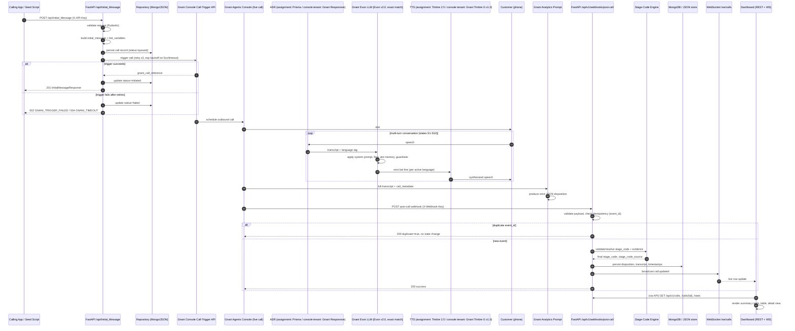
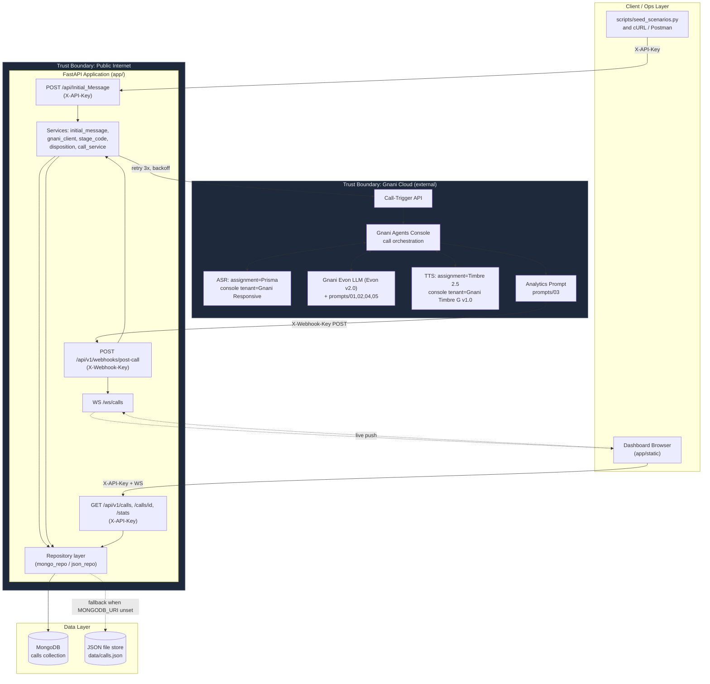

# Architecture Overview

## Data flow summary

1. A calling application (or the seed script) calls `POST /api/Initial_Message` with customer and
   EMI data, authenticated with `X-API-Key`.
2. `app/api/v1/calls.py` validates the request via Pydantic models
   (`app/models/requests.py::InitialMessageRequest`), builds the dynamic multilingual initial
   message and the bot-variable set (`app/services/initial_message.py`), and persists a `queued`
   call record through the repository layer (`app/repositories/`).
3. `app/services/gnani_client.py` calls the Gnani Agents Console call-trigger API (or simulates it
   in `GNANI_MODE=mock`) with retry + exponential backoff on 5xx/timeout
   (`GNANI_MAX_RETRIES`, `GNANI_RETRY_BACKOFF_SECONDS`). On success the record moves to
   `initiated`; on exhausted retries it moves to `failed` and the API returns `502`/`504`.
4. Gnani Agents Console places the outbound call. The live turn loop runs entirely inside Gnani's
   platform: **ASR** (assignment requirement: Prisma; this tenant's Console offers **Gnani
   Responsive** as the only Gnani-native ASR model — see below) transcribes the customer,
   **Evon LLM** (Console model: **Gnani Evon v2.0**, an exact match; loaded with
   `prompts/01-system-prompt.md` and `prompts/02-conversation-flow.md`) decides the next bot line
   per state and slot memory, **TTS** (assignment requirement: Timbre 2.5; this tenant's Console
   offers **Gnani Timbre G v1.0** as the only Gnani-native TTS model — see below) synthesizes it
   back to the customer. This loop repeats until a closure state is reached or the call
   disconnects.

   **Assignment-name vs. Console-tenant-name:** the assignment specifies Gnani Prisma ASR and
   Gnani Timbre 2.5 TTS by name. In the live Gnani Agents Console tenant used for this submission,
   neither "Prisma" nor "Timbre 2.5" is offered as a selectable model — only "Responsive" (ASR)
   and "Timbre G v1.0" (TTS) exist as Gnani-native options, and both were selected as the closest
   available match (the LLM, Evon v2.0, is an exact match). This is a tenant-level model
   naming/availability gap, not a deviation from using Gnani's native stack — a Gnani-native model
   was selected in every one of the three slots. The backend reads `GNANI_ASR_MODEL` /
   `GNANI_TTS_MODEL` / `GNANI_LLM_MODEL` from environment variables (see `.env.example`), so
   pointing at the exact-named models, once enabled for this tenant, is a one-field change with no
   code changes. Full detail: [`gnani_config/CONSOLE_FINDINGS.md`](../gnani_config/CONSOLE_FINDINGS.md)
   and [`gnani_config/README.md`](../gnani_config/README.md).
5. After the call ends, Gnani runs the Analytics prompt (`prompts/03-analytics-prompt.md`) over
   the transcript to produce the `disposition` object, then delivers it via the post-call webhook
   to `POST /api/v1/webhooks/post-call`, authenticated with `X-Webhook-Key`.
6. `app/api/v1/webhooks.py` validates the payload, checks idempotency by `event_id` (fallback
   `call_id + call_ended_at`), and if new, calls the **stage-code engine**
   (`app/services/stage_code.py`) to validate/downgrade the proposed stage code
   (see [`stage-code-logic.md`](./stage-code-logic.md)), then `app/services/disposition.py`
   normalises the disposition fields and `app/services/call_service.py` persists the update.
7. The repository layer writes to MongoDB (`app/repositories/mongo_repo.py`) if `MONGODB_URI` is
   set, otherwise to the JSON file fallback (`app/repositories/json_repo.py`).
8. `app/services/ws_manager.py` broadcasts a `call.updated` event over `WS /ws/calls`; the
   dashboard (`app/static/`) updates live, or falls back to 10-second polling of
   `GET /api/v1/calls` and `GET /api/v1/stats`.

## Sequence diagram

## Component diagram

See the rendered PNG at [`architecture-diagram.png`](./architecture-diagram.png) (generation
script: `docs/render_architecture_diagram.py`, kept alongside the PNG for reproducibility).

## Idempotency

- **Initial call creation:** `call_id` is generated server-side (`CALL-YYYYMMDD-NNNN`) at persist
  time, before the Gnani trigger call, so a retried `Initial_Message` request from a client is the
  caller's responsibility to de-duplicate (the assignment does not require idempotency on this
  endpoint, only on the webhook). Clients should treat `customer_id + loan_account_number +
  emi_due_date` as a natural de-dup key on their side if they retry.
- **Post-call webhook:** idempotency key is `event_id`; if absent, falls back to
  `call_id + call_ended_at`. `app/services/call_service.py` checks `webhook_event_ids[]` on the
  existing call record before applying any state change. A duplicate delivery returns
  `200 {"success": true, "duplicate": true, "call_id": ...}` with **no** field mutation and no
  new WebSocket broadcast — this satisfies assignment §9 scenario 10 and §5.3.8.

## Retry and timeout handling

| Boundary | Timeout | Retry policy | Failure outcome |
|---|---|---|---|
| FastAPI → Gnani call-trigger API | `GNANI_TIMEOUT_SECONDS` (default 10s) | `GNANI_MAX_RETRIES` (default 3) attempts, exponential backoff starting at `GNANI_RETRY_BACKOFF_SECONDS` (default 0.5s), via `tenacity` in `app/services/gnani_client.py` | Call record → `failed`; API responds `502 GNANI_TRIGGER_FAILED` or `504 GNANI_TIMEOUT` |
| Gnani Console → post-call webhook | Gnani-side retry, configured in `gnani_config/agent-config.json` → `webhook.post_call.retry_policy` | 3 retries, exponential backoff, retry on `408/429/5xx` | If all retries exhausted Gnani-side, the call is left in `initiated`/`connected` state in our store until manually reconciled — flagged in `docs/production-readiness.md` as a reconciliation job candidate |
| Dashboard ↔ WebSocket | n/a (persistent connection) | Client falls back to 10s polling if the socket closes | No data loss — REST endpoints remain the source of truth |

## Trust boundary

The **public internet boundary** sits directly in front of the FastAPI application: both
`/api/Initial_Message` and `/api/v1/webhooks/post-call` are internet-reachable and require header
based authentication (`X-API-Key`, `X-Webhook-Key` respectively), validated in
`app/core/security.py`. The **Gnani Cloud boundary** is a separate external trust zone — this
application never receives raw customer audio or ASR/TTS internals directly; it only receives
(a) an initiation acknowledgement (`gnani_call_reference`) synchronously, and (b) the finished
disposition + transcript asynchronously via the signed-by-header webhook. Nothing about the live
in-call state (partial transcript, mid-call slot memory) crosses the trust boundary until the call
is over — this bounds the blast radius of a compromised or delayed webhook to post-call data only,
never live call control. See [`production-readiness.md`](./production-readiness.md) for the
recommended upgrade from static-key auth to HMAC request signing at this boundary.
