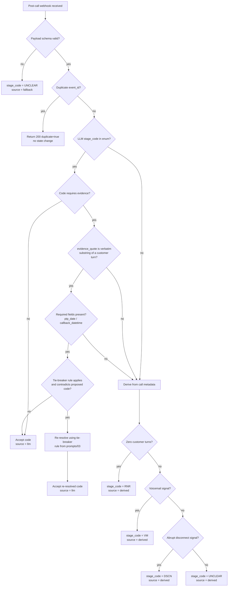

# Stage-Code Decision Logic

The final `stage_code` persisted on a call record is never taken from the LLM analytics output
directly. It passes through a deterministic post-processing pipeline in
`app/services/stage_code.py`, cross-referenced against the catalogue in
[`gnani_config/stage-codes.json`](../gnani_config/stage-codes.json) and the tie-breaker rules in
[`prompts/03-analytics-prompt.md`](../prompts/03-analytics-prompt.md).

## Full catalogue table

| Code | Group | Requires PTP date | Requires callback datetime | Requires evidence | Connect | Commitment | Priority |
|---|---|---|---|---|---|---|---|
| `PTP_TODAY` | ptp | yes | no | yes | yes | yes | 10 |
| `PTP_TOMORROW` | ptp | yes | no | yes | yes | yes | 10 |
| `PTP_FUTURE` | ptp | yes | no | yes | yes | yes | 10 |
| `PTP_PARTIAL` | ptp | yes | no | yes | yes | yes | 11 |
| `ALREADY_PAID` | already_paid | no | no | yes | yes | yes | 15 |
| `DISPUTE_PAID` | dispute | no | no | yes | yes | yes | 14 |
| `CALLBACK_SCHEDULED` | callback | no | yes | yes | yes | yes | 20 |
| `RTP_FINANCIAL` | rtp | no | no | yes | yes | yes | 25 |
| `RTP_MEDICAL` | rtp | no | no | yes | yes | yes | 25 |
| `DISPUTE_CHARGES` | dispute | no | no | yes | yes | yes | 26 |
| `NO_LOAN` | dispute | no | no | yes | yes | yes | 27 |
| `RTP_NO_REASON` | rtp | no | no | yes | yes | yes | 30 |
| `WRONG_NUMBER` | non_connect | no | no | yes | no | no | 40 |
| `THIRD_PARTY` | other | no | no | yes | yes | no | 41 |
| `BUSY` | non_connect | no | no | yes | yes | no | 45 |
| `RNR` | non_connect | no | no | no | no | no | 90 |
| `VM` | non_connect | no | no | no | no | no | 91 |
| `DSCN` | non_connect | no | no | no | yes | no | 95 |
| `UNCLEAR` | other | no | no | no | yes | no | 99 |

(Machine-readable source: [`gnani_config/stage-codes.json`](../gnani_config/stage-codes.json).)

## Evidence requirement

Every code marked `requires_evidence: true` in the catalogue requires a non-null
`evidence_quote` in the analytics output that is an **exact, case-sensitive substring** of some
`transcript[i].text` where `transcript[i].speaker == "customer"`. `app/services/stage_code.py`
performs this substring check verbatim — it does not use fuzzy or semantic matching. If the
substring check fails, evidence is treated as missing regardless of what the LLM's confidence
score claims.

## Deterministic post-processing pipeline

```
LLM proposed disposition (prompts/03-analytics-prompt.md output)
        │
        ▼
┌───────────────────────┐
│ 1. Schema validation   │  stage_code in enum? all required keys present? types correct?
└──────────┬────────────┘
           │ fail                                    pass
           ▼                                            │
   stage_code_source = "fallback"                       ▼
   stage_code = UNCLEAR                    ┌───────────────────────┐
                                            │ 2. Evidence validation │  evidence_quote is a verbatim
                                            └──────────┬────────────┘  substring of a customer turn?
                                                        │ fail                    pass
                                                        ▼                           │
                                          ┌───────────────────────┐                 ▼
                                          │ 3. Derive from         │   ┌───────────────────────┐
                                          │    call metadata       │   │ 4. Field completeness  │  ptp_date present if
                                          │    (RNR/VM/DSCN/BUSY   │   └──────────┬────────────┘  requires_ptp_date, etc.
                                          │    from call_status +  │              │ fail          pass
                                          │    transcript turn     │              ▼                │
                                          │    count)              │   downgrade to UNCLEAR         ▼
                                          └──────────┬────────────┘   stage_code_source="derived"  ┌─────────────────┐
                                                     │                                             │ 5. Tie-breaker   │
                                                     ▼                                             │    re-check      │
                                          stage_code_source = "derived"                            └────────┬────────┘
                                                                                                              │
                                                                                                              ▼
                                                                                                  stage_code_source = "llm"
                                                                                                  (validated LLM output accepted)
```

### Downgrade paths, explained

1. **LLM → validated**: the happy path. The analytics prompt's proposed `stage_code` passes
   schema validation, evidence-substring validation, required-field completeness, and does not
   contradict a tie-breaker rule. Stored with `stage_code_source: "llm"`.
2. **validated → derived**: any single check in step 1-4 fails. `app/services/stage_code.py`
   falls back to a deterministic derivation from call-level metadata alone (ignoring the LLM's
   proposed code entirely):
   - Zero customer turns in transcript + `call_status` connected → `RNR`.
   - Voicemail signal in call metadata → `VM`.
   - At least one customer turn, but `call_status` indicates disconnect/failure before a
     decidable moment → `DSCN`.
   - Otherwise → `UNCLEAR`.
   Stored with `stage_code_source: "derived"`.
3. **derived → fallback**: this is the terminal safety net — if even metadata-based derivation
   cannot produce a value (e.g., malformed webhook payload missing `call_status` and
   `transcript`), the system hard-codes `UNCLEAR` and flags the record for manual review via
   `audit_log[]`. Stored with `stage_code_source: "fallback"`.

This is a strictly one-directional downgrade chain — the system never upgrades a derived code
back to a more specific commitment code without new evidence arriving (e.g., a corrected
webhook redelivery with a matching `event_id` is treated as a duplicate and ignored, per
[CONTRACT.md](../CONTRACT.md) idempotency rules; a genuinely new webhook for the same call would
require a new `event_id` and is evaluated fresh on its own merits).

## Decision tree (mermaid)



## Worked examples

### Example A — accepted as-is (LLM → validated)
- Analytics output: `stage_code=PTP_FUTURE`, `evidence_quote="I can pay it on the 30th."`
- Transcript customer turn: `"Yeah I know, I've been busy. I can pay it on the 30th."`
- Substring check: passes (`"I can pay it on the 30th."` is contained in the turn text).
- `ptp_date` present and resolves against `call_date`. Result: `stage_code=PTP_FUTURE`,
  `stage_code_source=llm`.

### Example B — evidence check fails → downgraded to derived
- Analytics output: `stage_code=ALREADY_PAID`, `evidence_quote="I definitely paid that loan off completely."`
- Actual customer turn text: `"I think I paid it, not sure honestly."`
- Substring check: fails — the evidence text does not appear verbatim in any customer turn
  (the LLM paraphrased/hallucinated a stronger statement than what was said).
- Fallback: `call_status=completed`, customer turns > 0, no voicemail/disconnect signal →
  `stage_code=UNCLEAR`, `stage_code_source=derived`. This directly implements the "mandate
  UNCLEAR when evidence is missing" rule in `prompts/03-analytics-prompt.md`.

### Example C — tie-breaker re-resolution
- Analytics output: `stage_code=ALREADY_PAID`, `evidence_quote="I already paid that, why do you keep billing me for it?"`
- Tie-breaker rule A (ALREADY_PAID vs DISPUTE_PAID): the quote contains a complaint/correction
  framing ("why do you keep billing me") → re-resolve to `DISPUTE_CHARGES`-adjacent
  `DISPUTE_PAID`. Result: `stage_code=DISPUTE_PAID`, `stage_code_source=llm` (re-resolved, still
  LLM-evidence-backed, just corrected per the documented tie-breaker, not a metadata fallback).

### Example D — metadata-only derivation
- Post-call webhook: `call_status=no_answer`, `transcript=[]`.
- No LLM analytics pass runs at all in this case (no conversation occurred) — Console sends the
  webhook with an empty transcript. `app/services/stage_code.py` derives directly:
  zero customer turns → `stage_code=RNR`, `stage_code_source=derived`.

## Cross-reference

- Implementation: `app/services/stage_code.py` (owned by backend team; this document describes
  its externally observable contract for the assignment's stage-code and disposition-accuracy
  evaluation criterion).
- Enum and catalogue: [`gnani_config/stage-codes.json`](../gnani_config/stage-codes.json).
- LLM-side rules it enforces: [`prompts/03-analytics-prompt.md`](../prompts/03-analytics-prompt.md).
- Stored field: `stage_code_source` on `CallDetail` (`llm` | `derived` | `fallback`), returned by
  `GET /api/v1/calls/{call_id}` per [CONTRACT.md](../CONTRACT.md).
