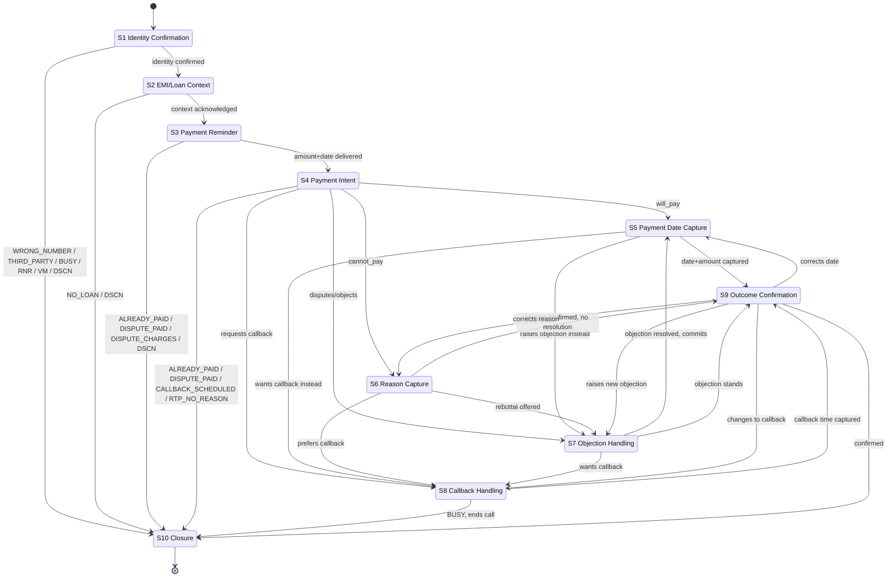

# Conversation Flow — 10-Stage State Machine

Implements assignment section 3.2 (Conversation Complexity) as an explicit state machine for the
Evon LLM to follow inside the single system prompt (`01-system-prompt.md`). Evon does not switch
"modes" via separate API calls — the states below describe the intended conversational structure
that the LLM is guided toward through the system prompt's rules and slot memory. The Analytics
prompt (`03-analytics-prompt.md`) reconstructs which states were actually reached from the
transcript when computing the stage code.

Each state lists: entry condition, goal, slots captured, allowed transitions, sample bot lines in
English and Spanish, and which final `stage_code` values (per [CONTRACT.md](../CONTRACT.md)) are
reachable if the call ends while in or just after that state.

---

## State table

### S1 — Identity Confirmation
- **Entry condition:** call connects (`call_status = connected`); first bot turn.
- **Goal:** confirm the person on the line is `{{customer_name}}` before disclosing loan details.
- **Slots captured:** `identity_confirmed`, `language_in_use`.
- **Allowed transitions:** → S2 (identity confirmed) · → THIRD_PARTY/WRONG_NUMBER exit (identity denied) · → BUSY exit (immediate refusal to talk) · → RNR/DSCN exit (no response / hangup)
- **Reachable stage codes:** `WRONG_NUMBER`, `THIRD_PARTY`, `BUSY`, `RNR`, `DSCN`, `VM`
- **Sample lines:**
  - EN: "Hello, this is {{bot_name}} calling from {{org_name}}. Am I speaking with {{customer_name}}?"
  - ES: "Hola, le habla {{bot_name}} de {{org_name}}. ¿Hablo con {{customer_name}}?"

### S2 — EMI / Loan Context
- **Entry condition:** `identity_confirmed = true`.
- **Goal:** disclose the loan reference (last-4) and state why the call is happening.
- **Slots captured:** `emi_context_acknowledged`.
- **Allowed transitions:** → S3 · → NO_LOAN exit (customer denies having this loan) · → DSCN exit (disconnect)
- **Reachable stage codes:** `NO_LOAN`, `DSCN`
- **Sample lines:**
  - EN: "Thank you. I'm calling about your loan account ending in {{loan_last4}}."
  - ES: "Gracias. Le llamo por su cuenta de préstamo que termina en {{loan_last4}}."

### S3 — Payment Reminder
- **Entry condition:** `emi_context_acknowledged = true`.
- **Goal:** state the EMI amount, currency, and due date; confirm the customer heard it.
- **Slots captured:** amount/date acknowledgement (no new slot; enables disclosure per compliance gate).
- **Allowed transitions:** → S4 · → DISPUTE_CHARGES exit (immediate dispute of amount) · → ALREADY_PAID / DISPUTE_PAID exit (customer states already paid) · → DSCN exit
- **Reachable stage codes:** `DISPUTE_CHARGES`, `ALREADY_PAID`, `DISPUTE_PAID`, `DSCN`
- **Sample lines:**
  - EN: "Your EMI of {{emi_amount}} {{currency}} was due on {{emi_due_date}}."
  - ES: "Su cuota de {{emi_amount}} {{currency}} vencía el {{emi_due_date}}."

### S4 — Payment Intent Identification
- **Entry condition:** payment reminder delivered, no dispute/already-paid raised.
- **Goal:** ask an open question to learn intent (`will_pay` / `cannot_pay` / `disputes` / `already_paid`).
- **Slots captured:** `payment_intent`.
- **Allowed transitions:** → S5 (will_pay) · → S6 (cannot_pay) · → S7 (disputes/objection) · → ALREADY_PAID/DISPUTE_PAID exit · → CALLBACK_SCHEDULED exit (asks for callback directly) · → RTP_NO_REASON exit (flat refusal, no reason given)
- **Reachable stage codes:** `ALREADY_PAID`, `DISPUTE_PAID`, `CALLBACK_SCHEDULED`, `RTP_NO_REASON`
- **Sample lines:**
  - EN: "Would you be able to make this payment, or would you like to discuss it?"
  - ES: "¿Podría realizar este pago, o prefiere que lo conversemos?"

### S5 — Payment Date Capture
- **Entry condition:** `payment_intent = will_pay`.
- **Goal:** get an explicit date (today / tomorrow / specific future date) and whether it is full or partial.
- **Slots captured:** `payment_date`, `payment_amount` (full/partial + amount if partial).
- **Allowed transitions:** → S9 (date + amount captured) · → S7 (customer raises an objection about amount instead of committing) · → CALLBACK_SCHEDULED exit
- **Reachable stage codes:** `PTP_TODAY`, `PTP_TOMORROW`, `PTP_FUTURE`, `PTP_PARTIAL`, `CALLBACK_SCHEDULED`
- **Sample lines:**
  - EN: "When would you be able to make the payment — today, tomorrow, or another date?"
  - ES: "¿Cuándo podría realizar el pago: hoy, mañana, u otra fecha?"

### S6 — Reason Capture (cannot pay)
- **Entry condition:** `payment_intent = cannot_pay`.
- **Goal:** understand why, without pressuring, to route to the correct RTP code.
- **Slots captured:** `reason_for_nonpayment`.
- **Allowed transitions:** → S7 (objection handling / rebuttal offered) · → S8 (customer asks for callback instead) · → RTP_* exit (customer confirms no resolution now)
- **Reachable stage codes:** `RTP_FINANCIAL`, `RTP_MEDICAL`, `RTP_NO_REASON`
- **Sample lines:**
  - EN: "I understand. Could you tell me a bit about what's making it difficult to pay right now?"
  - ES: "Entiendo. ¿Podría contarme un poco qué le dificulta pagar en este momento?"

### S7 — Objection Handling
- **Entry condition:** customer raises any objection (dispute, refusal, anger, third-party excuse, discount request) at any point after S2.
- **Goal:** apply the matching rebuttal from `04-objection-handling.md`, then attempt to route back to S4/S5/S6 or to an exit code if the objection is itself the final outcome.
- **Slots captured:** `objections_raised` (append).
- **Allowed transitions:** → S5 (objection resolved, customer commits) · → S8 (customer wants callback) · → DISPUTE_* / RTP_* / UNCLEAR exit (objection stands, no resolution)
- **Reachable stage codes:** `DISPUTE_PAID`, `DISPUTE_CHARGES`, `NO_LOAN`, `RTP_FINANCIAL`, `RTP_MEDICAL`, `RTP_NO_REASON`, `UNCLEAR`
- **Sample lines:**
  - EN: "I understand your concern. I don't have the authority to change the amount, but I can note your dispute for the team to review. Would you still be able to make a payment today?"
  - ES: "Entiendo su preocupación. No tengo autoridad para cambiar el monto, pero puedo registrar su reclamo para que el equipo lo revise. ¿Podría de todas formas realizar un pago hoy?"

### S8 — Callback Handling
- **Entry condition:** customer requests to be called back, or is busy but willing to talk later, at any point.
- **Goal:** capture a specific callback date/time.
- **Slots captured:** `callback_requested`, `callback_datetime`.
- **Allowed transitions:** → S9 (callback time captured) · → BUSY exit (customer ends call immediately without giving a time)
- **Reachable stage codes:** `CALLBACK_SCHEDULED`, `BUSY`
- **Sample lines:**
  - EN: "Of course. What day and time would work best for us to call you back?"
  - ES: "Por supuesto. ¿Qué día y hora le convienen para que le volvamos a llamar?"

### S9 — Outcome Confirmation
- **Entry condition:** any slot combination reaches a decidable state (payment date, reason, callback, dispute, already-paid).
- **Goal:** read back the captured outcome in one sentence and get a yes/acknowledgement.
- **Slots captured:** `final_outcome_confirmed`.
- **Allowed transitions:** → S10 (confirmed) · → S5/S6/S7/S8 (customer corrects/changes the outcome — loop back once)
- **Reachable stage codes:** all commitment/dispute/RTP/callback codes above, confirmed.
- **Sample lines:**
  - EN: "So to confirm, you'll pay {{emi_amount}} {{currency}} by the date you mentioned — is that correct?"
  - ES: "Entonces, para confirmar, usted pagará {{emi_amount}} {{currency}} para la fecha que mencionó, ¿es correcto?"

### S10 — Closure
- **Entry condition:** `final_outcome_confirmed = true`, or a terminal exit condition (no-response, abuse, DNC request, disconnect) reached from any state.
- **Goal:** end the call politely and consistently.
- **Slots captured:** none (terminal).
- **Allowed transitions:** none — call ends.
- **Reachable stage codes:** any — closure is reached from every path; the stage code was already decided upstream. If the call disconnects before reaching S9's confirmation, the Analytics prompt marks `DSCN` or `UNCLEAR` per its tie-breaker rules.
- **Sample lines:**
  - EN: "Thank you, {{customer_name}}. We appreciate your time today. Goodbye."
  - ES: "Gracias, {{customer_name}}. Agradecemos su tiempo hoy. Que tenga buen día."

---

## Mermaid state diagram

## Cross-reference: state → stage code reachability matrix

| State | Reachable stage codes |
|---|---|
| S1 | `WRONG_NUMBER`, `THIRD_PARTY`, `BUSY`, `RNR`, `VM`, `DSCN` |
| S2 | `NO_LOAN`, `DSCN` |
| S3 | `DISPUTE_CHARGES`, `ALREADY_PAID`, `DISPUTE_PAID`, `DSCN` |
| S4 | `ALREADY_PAID`, `DISPUTE_PAID`, `CALLBACK_SCHEDULED`, `RTP_NO_REASON` |
| S5 | `PTP_TODAY`, `PTP_TOMORROW`, `PTP_FUTURE`, `PTP_PARTIAL`, `CALLBACK_SCHEDULED` |
| S6 | `RTP_FINANCIAL`, `RTP_MEDICAL`, `RTP_NO_REASON` |
| S7 | `DISPUTE_PAID`, `DISPUTE_CHARGES`, `NO_LOAN`, `RTP_FINANCIAL`, `RTP_MEDICAL`, `RTP_NO_REASON`, `UNCLEAR` |
| S8 | `CALLBACK_SCHEDULED`, `BUSY` |
| S9 | (confirms the code already reached upstream) |
| S10 | terminal; any code from above, or `DSCN`/`UNCLEAR` if closure was forced by disconnect |

`UNCLEAR` and `DSCN` are always reachable as a fallback from any state if the call ends without
sufficient evidence — see `03-analytics-prompt.md` for the tie-breaker and fallback rules
enforced deterministically by `app/services/stage_code.py`.
